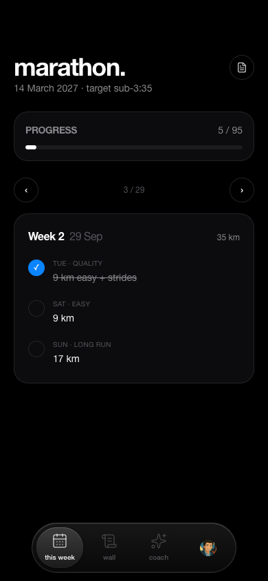
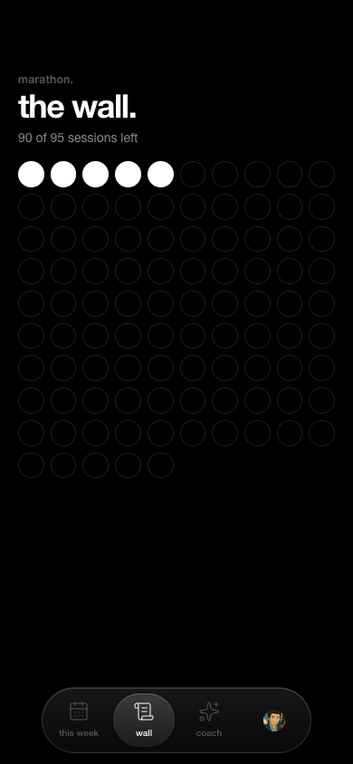
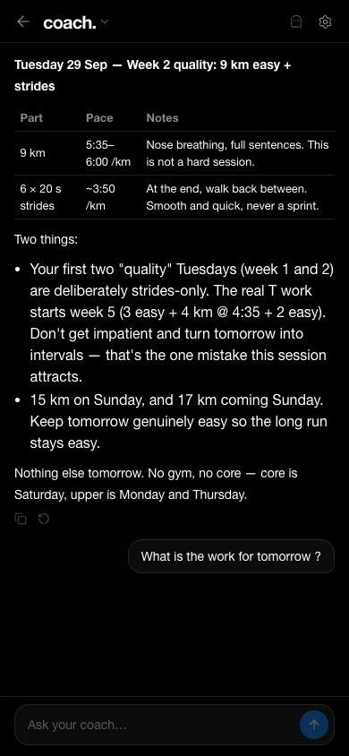

# marathon.

> A single-user marathon training tracker with an AI coach.

A personal PWA for a 14 March 2027 marathon plan: this week's sessions, a wall of every session in the plan, and a coach that knows the plan and what's been done. Same visual language as my other project, [hundred.](https://github.com/polcabezas/hundred-showcase).

**Live app:** private, single user.
**Source:** private. This repo is the case study.

  
  
  
  

## What it does

- **This week**: the sessions for the current week (quality, easy, long run), with a progress bar across the whole plan. Tick a session off and it's recorded.
- **The wall**: one dot per session in the plan. It fills up as the plan gets done, so the remaining work is always visible.
- **Coach**: a multi-conversation AI coach with memory. It's blunt, gives no flattery, and knows the full plan, the gym program, paces, race strategy and what's been checked off.
- **Training reminders**: web push, scheduled server-side.
- **Installable**: works as a PWA on iOS.

## Stack

| Layer | Choice |
|---|---|
| App | Next.js (App Router), TypeScript, Tailwind, shadcn/ui |
| Data and auth | Supabase: Postgres, Google sign-in, Row Level Security |
| Push | Web Push, sent from a Supabase Edge Function on a `pg_cron` schedule |
| AI | Vercel AI SDK `useChat`, streaming, provider-configurable with a fallback |
| Tests | Vitest, plus typecheck and lint gates |
| Hosting | Vercel |

## Engineering decisions worth talking about

**The coach is read-only over training data.** Every message rebuilds the full plan and the live check status into the system prompt, so the coach can never work from stale state. Its only writes are its own conversations and memories. It can't tick sessions off, change the plan or touch anything else.

**Provider-agnostic AI layer.** The model and provider are user preferences, with a fallback provider. Keys stay server-side and never reach the client.

**Locked to one account.** Row Level Security protects the data, and the coach is further restricted to a single allowed email, so a stray sign-in gets nothing.

**I replaced a chat library with a small hand-rolled UI.** I started on `assistant-ui`, then rebuilt the chat as minimal React on `useChat` plus `react-markdown`. That gave full control over keyboard handling (only the composer lifts with the keyboard on iOS), streaming and scroll behaviour. Thread persistence is done by the client through plain API routes, upserting by message id so retries are safe.

**Spec first.** The coach was designed in a written spec before any code: goals, resolved decisions, memory model and phasing. Strava sync is deliberately post-v1 and slots into a stable context section, so nothing changes when it lands.

**No secrets in git.** All keys live in environment variables and Supabase secrets, and none are committed.

## Status

In daily use during training. Source available to discuss in an interview.
